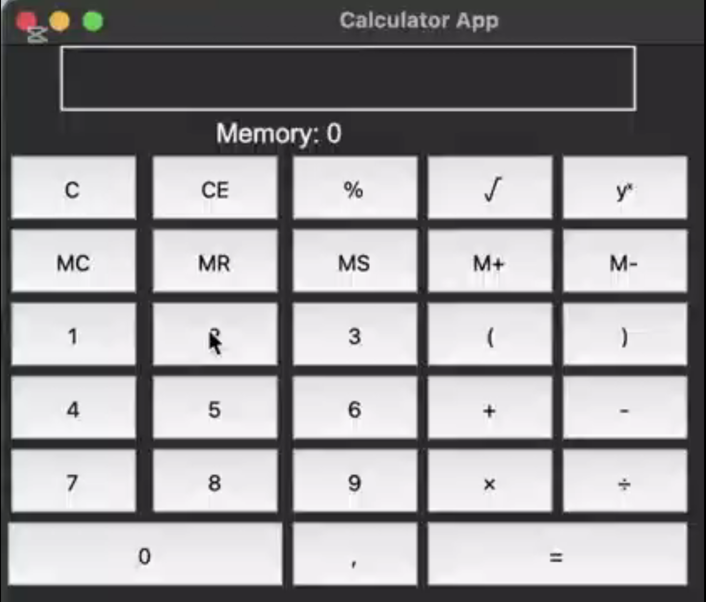

Python Calculator with Tkinter

This is a simple calculator application built using Python and the Tkinter library. The calculator provides basic arithmetic operations and a user-friendly graphical interface.

Features:
- Basic arithmetic operations: Addition, Subtraction, Multiplication, and Division
- Clear and backspace functionality
- Intuitive Tkinter GUI

Requirements:
Ensure you have Python installed on your system. You can install the required dependencies using:

    pip install tk

Installation and Usage:
1. Clone this repository or download the source code:
   
    git clone https://github.com/DaniIliev/Calc-PY.git
    cd tkinter-calculator

2. Run the Python script:

    python calculator.py

Video:

